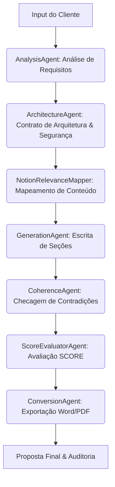

# Nimbus — Geração Inteligente de Propostas Técnicas

> Plataforma avançada para automação de propostas técnicas de arquitetura, integrando IA, Notion, AWS e fluxos auditáveis. Ideal para consultorias, squads de arquitetura e times de pré-vendas.

---

## 🚀 Visão Geral

O Nimbus é um servidor MCP (Model Context Protocol) que orquestra múltiplos agentes inteligentes para transformar requisitos de clientes em propostas técnicas completas, auditáveis e customizáveis. Ele integra:

- **IA Generativa (OpenAI GPT-4o)** para análise, escrita e revisão
- **Notion** como fonte dinâmica de templates, regras e exemplos
- **AWS Documentation** para recomendações arquiteturais
- **Auditoria detalhada** e integração nativa com IDEs modernas (VSCode, Amazon Kiro)

---


## 💬 Como Usar: Chat do VSCode ou Kiro

O principal fluxo de uso do Nimbus é via chat integrado ao VSCode ou Amazon Kiro IDE. Basta abrir o chat, selecionar o servidor MCP **"nimbus"** e interagir em linguagem natural:

1. **Descreva o que você precisa** (ex: "Preciso de uma proposta para migrar um sistema legado para AWS com alta disponibilidade e baixo custo.")
2. O agente irá analisar, perguntar detalhes se necessário, e gerar a proposta técnica completa.
3. Você pode pedir revisões, exportar para Word/PDF, ou solicitar explicações sobre decisões arquiteturais.

**Não é necessário rodar scripts Python manualmente!**

---

## 📎 Análise de Arquivos Anexados

O Nimbus suporta análise inteligente de arquivos anexados para enriquecer propostas técnicas:

### Formatos Suportados
- **PDF** (.pdf): Texto completo e extração de tabelas
- **Word** (.docx): Texto, tabelas e formatação estrutural
- **Excel** (.xlsx, .xls): Planilhas como dados tabulares
- **CSV** (.csv): Dados tabulares com detecção automática de delimitadores
- **Texto** (.txt): Arquivos de texto plano com múltiplos encodings

### Fontes de Arquivos
- **Locais**: Caminhos absolutos/relativos no sistema de arquivos
- **S3**: URLs no formato `s3://bucket-name/key-name`
- **Auto-detecção**: Arquivos relevantes no workspace atual do VSCode/Kiro

### Como Usar

#### 1. Arquivos Locais
```python
# Anexar arquivos específicos
orchestrator.generate_proposal(
    "Preciso de uma proposta para sistema web",
    file_paths=["C:\\docs\\requisitos.pdf", "C:\\dados\\planilha.xlsx"]
)
```

#### 2. Arquivos S3
```python
# Usar arquivos do S3
orchestrator.generate_proposal(
    "Preciso de uma proposta para sistema web",
    file_paths=["s3://my-bucket/requirements.pdf", "s3://my-bucket/data.xlsx"]
)
```

#### 3. Auto-detecção
```python
# Detectar automaticamente arquivos relevantes no workspace
orchestrator.generate_proposal(
    "Preciso de uma proposta para sistema web",
    auto_detect_files=True
)
```

### Como Funciona
1. **Upload/Acesso**: Arquivos locais são lidos diretamente, S3 são baixados temporariamente
2. **Detecção**: Auto-detecção encontra PDFs, docs, planilhas no diretório atual
3. **Análise Automática**: Sistema detecta tipo e extrai conteúdo relevante
4. **Integração**: Conteúdo é incorporado ao contexto da proposta na IA
5. **Fallback Graceful**: Sistema continua funcionando mesmo sem bibliotecas específicas

### Arquitetura de Análise
O `AnalysisAgent` integra diretamente os agentes especializados:
- `PDFAnalysisAgent` (usa PyPDF2 + pdfplumber)
- `DocxAnalysisAgent` (usa python-docx)
- `XlsxAnalysisAgent` (usa openpyxl)
- `CsvAnalysisAgent` (nativo com detecção de encoding)
- `TxtAnalysisAgent` (nativo com detecção de encoding)

Para S3: `S3FileReader` baixa arquivos temporariamente antes da análise.
Para auto-detecção: `WorkspaceFileDetector` escaneia diretório por arquivos relevantes.

---

## 🏗️ Arquitetura e Fluxo dos Agentes



**OrchestratorAgent** centraliza o estado, lida com falhas, faz logging e expõe a API MCP.

---

## ✨ Principais Diferenciais

- Geração de propostas técnicas completas, com seções customizadas e contexto real de negócio
- Integração nativa com Notion (cache local, templates dinâmicos, regras vivas)
- Avaliação automática de coerência e qualidade (SCORE)
- Exportação profissional (Word/PDF) pronta para cliente
- Auditoria detalhada de cada etapa (com logs e rastreabilidade)
- Pronto para uso em VSCode, Amazon Kiro IDE e pipelines CI/CD

---

## 🛠️ Como Clonar, Instalar e Rodar

```bash
git clone https://github.com/seu-usuario/Nimbus.git
cd Nimbus
python -m venv .venv
.venv\Scripts\activate  # Windows
# ou
source .venv/bin/activate  # Linux/Mac
pip install -e .
```

---


## 💻 Configuração no VSCode

1. Instale as extensões "Python" e (opcional) "Strands Agents".
2. Abra a pasta do projeto.
3. Ative o ambiente virtual (Ctrl+Shift+P → Python: Select Interpreter).
4. Configure `OPENAI_API_KEY` no `.env` ou nas configurações do VSCode.
5. Para integração MCP, crie `.vscode/mcp.json`:

```json
{
	"servers": {
		"nimbus": {
			"type": "stdio",
			"command": "python",
			"args": ["-m", "server"],
			"env": {
				"OPENAI_API_KEY": "${input:openai-api-key}"
			}
		}
	}
}
```

---


## ☁️ Configuração no Amazon Kiro IDE

1. Abra o projeto clonado no Kiro IDE.
2. Configure o MCP Server em `.kiro/settings/mcp.json` (usando o nome "nimbus" como no exemplo acima).
3. Ative o ambiente virtual e instale as dependências.

---

## 🔑 Variáveis de Ambiente

- `OPENAI_API_KEY` — Chave da API OpenAI (obrigatória)
- `NIMBUS_NOTION_CACHE_PATH` — Caminho customizado para cache do Notion (opcional)
- `NIMBUS_AUDIT_LOG_PATH` — Caminho para logs de auditoria (opcional)
- Outras: ver comentários em `src/agents/orchestrator.py`

---

## 🧑‍💻 Como Usar

### Via MCP (VSCode/Kiro)

O servidor expõe ferramentas como:

- `analyze_requirements`: Analisa input do cliente e extrai requisitos
- `generate_proposal`: Gera proposta técnica completa
- `get_proposal_status`: Consulta status da geração

### Via Python

```python
from agents import AnalysisAgent, GenerationAgent

# Analisar requisitos
analysis_agent = AnalysisAgent()
resultado = analysis_agent.analyze("Criar uma plataforma de e-commerce...")

# Gerar proposta
generation_agent = GenerationAgent()
secoes = generation_agent.generate_full_proposal(resultado)
```

---

## 🧩 Estrutura dos Agentes

- **OrchestratorAgent**: Orquestra todo o fluxo, mantém estado e auditoria
- **AnalysisAgent**: Analisa requisitos do cliente e conteúdo de arquivos anexados
  - **PDFAnalysisAgent**: Extrai texto e tabelas de arquivos PDF
  - **DocxAnalysisAgent**: Extrai texto e tabelas de documentos Word (.docx)
  - **XlsxAnalysisAgent**: Extrai dados de planilhas Excel (.xlsx, .xls)
  - **CsvAnalysisAgent**: Processa arquivos CSV com detecção automática de delimitadores
  - **TxtAnalysisAgent**: Processa arquivos de texto plano com detecção de encoding
- **ArchitectureAgent**: Gera arquitetura e avalia segurança
- **NotionRelevanceMapper**: Mapeia seções do template para conteúdos do Notion
- **GenerationAgent**: Gera texto de cada seção da proposta
- **CoherenceAgent**: Checa coerência e sugere correções
- **ScoreEvaluatorAgent**: Avalia a proposta segundo SCORE
- **ConversionAgent**: Prepara proposta para exportação
- **WriterAgent**: Escreve seções individuais com contexto e regras

---

## 🗂️ Integrações e Componentes

- **Notion Cache Layer**: Espelha todo o conteúdo do Notion localmente (SQLite), garantindo performance e resiliência
- **AWS Docs MCP Client**: Consulta melhores práticas AWS via Strands MCP
- **Auditoria**: Logs detalhados em `.nimbus_audit/` (ativado por padrão)

---

## 📝 Auditoria, Logs e Troubleshooting

- Todas as ações são auditadas (JSONL em `.nimbus_audit/`)
- Logs detalhados no console e arquivos
- Falhas de integração (Notion/AWS) não bloqueiam o fluxo — o sistema é resiliente
- Para debugging, ative o modo verbose nas variáveis de ambiente

---

## 🤝 Contribuição

1. Fork este repositório
2. Crie uma branch descritiva
3. Envie um Pull Request detalhado
4. Dúvidas? Abra uma Issue

---

## 📄 Licença

MIT — Sinta-se livre para usar, modificar e contribuir.

